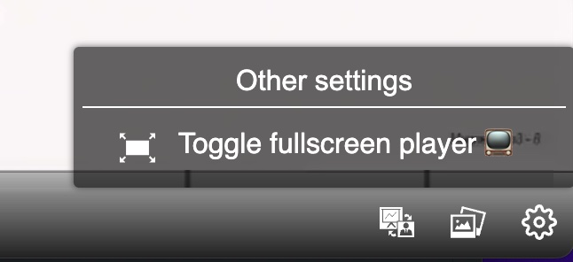

# Localization

The text localization system in `paella-core` is quite extensive. It implements its own dictionary system, but it also has APIs that allow you to integrate it with other localization systems. In this tutorial we are only going to see the most basic part: adding dictionaries for text translation.

The `paella-core` and plugin texts are usually localized, but only in a few languages. In addition to this, there may be new texts that will not be in the default dictionaries, for example, those added in the configuration file. For this reason we have to have a system to add new texts and also new dictionaries.

## Player language

`paella-core` gets its default language from the browser. For this it uses the `navigator.language` property. This value will be the one used to obtain the dictionary. Each dictionary we add to `paella-core` is tagged with a unique identifier, which corresponds to the value of this property. 

The `navigator.language` property can also return texts with localization by region, for example `es-ES` corresponds to the Spanish language of Spain. When adding dictionaries you have to take this into account: if you want to support several regions, you would have to add the dictionaries of all of them.

There is no plugin to change the player language. Normally the browser language will suffice. However, you can change the player language using the `setLanguage()` API.

```js
const player = new Paella(...);
...
player.setLanguage("en");
```

If we do not have a dictionary defined for the browser language, all text strings will fail. For that reason, in the configuration you can define a property to get a fallback language. Edit the `settings.json` file to add this new property:

```json
{
    "defaultLanguage": "en",
    ...
}
```

By adding this property, we can be sure that if we add a dictionary for the `en` language, a translation string will always be found.

## Add dictionary

To add dictionaries just use the `player.addDictionary()` API after calling `loadManifest()`:

```js
player = new Paella(...)
...
player.loadManifest();
player.addDictionary(lang, dict);
```

Plugins can add their own dictionaries. If we use `addDictionary()` after `loadManifest()`, the text strings we put in will have priority over those in the dictionaries defined by the plugins. If what we want is to add only those texts that may be missing in the dictionaries, then we will want the plugins dictionaries to have priority over our dictionaries. In that case we have to call `addDictionary()` from the `loadDictionaries` callback defined in the `initParams` object.

The `loadDictionaries` callback is executed before loading the plugins, so the dictionary strings defined by the plugins will overwrite the strings added in this callback.

In the default implementation of `loadDictionaries` is where the default language of `paella-core` is set. If we define this callback, we have to define the default language selection method as well. In the following example the browser language is set, which is the same behavior that `loadDictionaries` has by default:

```js
const initParams = {
    ...
    loadDictionaries: player => {
        player.setLanguage(navigator.language);
        player.addDictionary(lang, dict);
    }
}
```

Let's see an example of this. To begin with, we are going to add some text to translate. In the `settings.json` file, in the part where we define the group of actions, we are going to add the `menuTitle` property:

```json
{
    "buttonGroups": [
        {
            "enabled": true,
            "groupName": "options",
            ...
            "menuTitle": "other_settings"
        }
    ],
    ...
```

We have used the `other_settings` text so that we can clearly see how the string is translated. We are going to use the `loadDictionary` callback. Remember that, in this case, we have to manually set the browser's default language:

```js
const initParams = {
    ...
    loadDictionaries: player => {
        player.setLanguage(navigator.language);

        const en = {
            "other_settings": "Other settings"
        }
        const es = {
            "other_settings": "Otros ajustes"
        }
        player.addDictionary('en', en);
        player.addDictionary('en-UK', en);
        player.addDictionary('en-US', en);
        player.addDictionary('es', es);
        player.addDictionary('es-ES', es);
        player.addDictionary('es-LA', es);
    }
};
const player = new Paella('player-container', initParams);
```



Previous tutorial: [Video manifest: captions](video_manifest_captions.md)
Next tutorial: [Accessibility](accessibility.md)